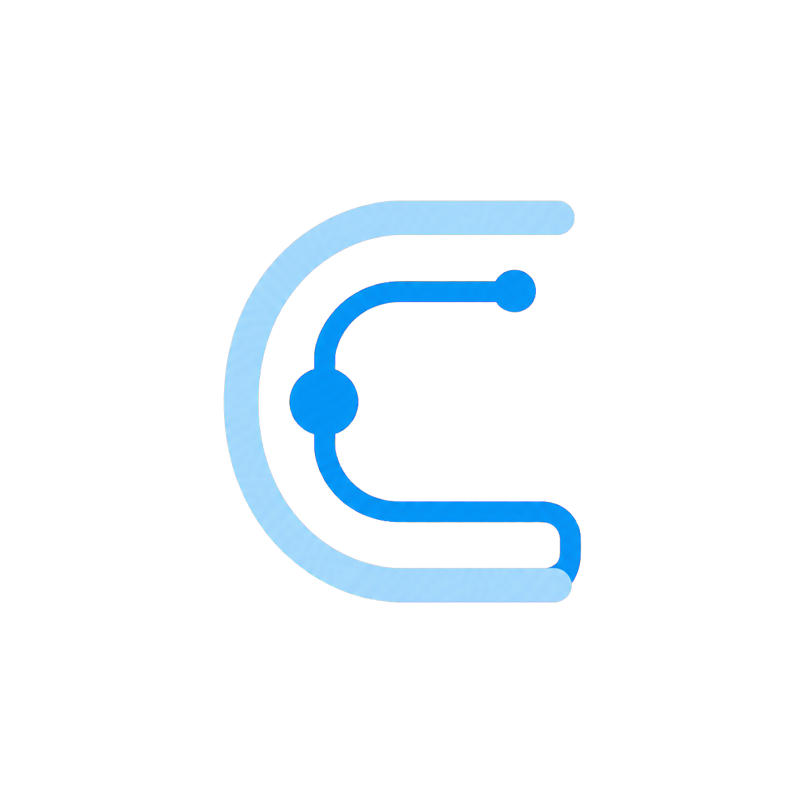
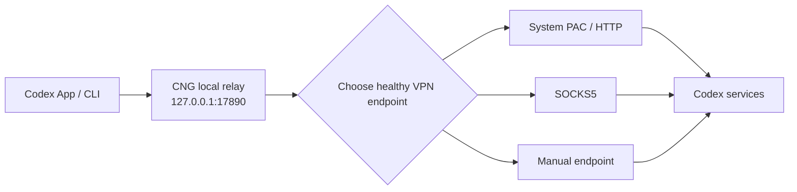

<p align="center">
  
</p>

<h1 align="center">Codex Network Guard</h1>

<p align="center"><strong>Keep Codex on your VPN route—without gambling on another retry.</strong></p>

<p align="center">
  <a href="README.md">简体中文</a> ·
  <a href="https://github.com/bei666qi-pan/codex_no5-5/releases">Download Releases</a> ·
  <a href="#quick-start">Quick start</a> ·
  <a href="#troubleshooting">Troubleshooting</a>
</p>

> Unofficial project. Codex Network Guard (CNG) is not affiliated with or endorsed by OpenAI.

Codex can open, but regularly reaches `5/5`, takes a long time to recover after a VPN restart, or behaves differently in the App and CLI? CNG gives **Codex App and CLI** one stable local entry point. It discovers the PAC, HTTP, HTTPS CONNECT, or SOCKS5 endpoint that your VPN already exposes, then routes new Codex connections through the healthy route.

## Contents

- [Quick start](#quick-start)
- [What it solves](#what-it-solves)
- [Compatibility](#compatibility)
- [Safety and privacy](#safety-and-privacy)
- [Troubleshooting](#troubleshooting)
- [CLI and advanced use](#cli-and-advanced-use)
- [Development, testing, and releases](#development-testing-and-releases)

## Quick start

### For first-time users

1. Download a build from [GitHub Releases](https://github.com/bei666qi-pan/codex_no5-5/releases): `.dmg` for macOS or the x64 portable ZIP for Windows.
2. Open **Codex Network Guard** and choose **Check and enable**.
3. Close and reopen Codex once.

That is all. CNG does not need a restart when your VPN changes nodes, restarts, or changes its local port. Use the language selector in the app header to switch between English and Chinese; your choice is remembered.

### Read the status first

| Status | Meaning | What to do |
| --- | --- | --- |
| **Connection protected** | Codex is using a healthy VPN route | Keep working |
| **VPN required** | No usable local proxy entry point was found | Start the VPN and select **Refresh check** |
| **Connection needs attention** | The route works but recent checks are unstable | Change node or protocol in the VPN app, then refresh |
| **Codex needs attention** | A login, rate-limit, server, or Codex issue was identified | Follow the suggested action; do not blindly switch VPNs |

## What it solves

| Problem | What CNG does |
| --- | --- |
| Codex does not consistently inherit the proxy | Injects one fixed local proxy entry point for Codex without changing the system-wide proxy |
| A VPN restart or node switch changes the local port | Re-discovers and selects healthy upstreams every five seconds; only new connections switch |
| HTTP and SOCKS5 behave differently | Presents one standard HTTP/HTTPS CONNECT relay to Codex |
| A VPN pause could result in direct traffic | Blocks direct fallback by default and returns a diagnosable local error |
| `5/5` does not reveal whether it is network, login, or rate limiting | `cng doctor` classifies proxy, DNS, TLS, WebSocket, 401/403, 429, 5xx, and Codex failures |



## Compatibility

“Compatible with VPNs” means compatible with a standard proxy endpoint exposed **locally** by a VPN client. CNG does not read, modify, or control VPN nodes, subscriptions, or rules.

| Exposed interface | Support | Automated verification |
| --- | --- | --- |
| macOS system proxy and PAC | Supported | `scutil` fields and PAC route parsing |
| Windows system proxy and PAC | Supported | Registry fields and protocol mapping |
| Local HTTP port | Supported | CONNECT tunnel, 407, and port recovery |
| Local HTTPS CONNECT port | Supported | Candidate discovery and connection path |
| SOCKS5 / mixed port | Supported | SOCKS5 handshake and remote DNS |
| Clash Verge Rev, ClashX, Surge, V2RayU, and similar clients | Compatible with the interfaces above | Depends on the entry point the client exposes |

The automated suite also asserts that a stopped VPN route never reaches the target directly, and that a healthy existing tunnel stays open while the next connection uses a recovered port. See [docs/testing.md](docs/testing.md) for the full matrix. CNG deliberately does not execute arbitrary PAC JavaScript; for a complex domain-specific PAC, enter the VPN client's local HTTP or SOCKS5 address in **Set a local proxy manually**.

## Safety and privacy

- Listens only on `127.0.0.1:17890` and accepts local connections only.
- Does not enable TUN, change the system-wide proxy, or read or modify VPN configuration.
- Does not intercept TLS or read Codex chats, code, tokens, or request bodies.
- Blocks direct fallback by default and fails fast when no VPN route is available.
- On macOS, manual upstream credentials are stored in Keychain. Diagnostic logs are redacted and capped at seven days and 20 MB.

## Troubleshooting

### Auto-detection cannot find my VPN

Open **Set a local proxy manually** and enter the local address displayed by your VPN app, such as `http://127.0.0.1:7890` or `socks5h://127.0.0.1:7891`. Do not enter a subscription URL. CNG tests the route before using it; choose **Return to auto-select** to restore the default mode.

### Can CNG guarantee that `5/5` never appears?

No responsible tool can make that claim. CNG addresses proxy inheritance, port changes, HTTP/SOCKS incompatibility, and routing failures. Similar retries can also be caused by expired login, account permissions, 429 rate limits, server errors, or Codex itself. Use **View diagnostics** or `cng doctor` to identify the category.

### Does phone remote control work?

CNG can keep the remote-control process alive on the computer. It only ensures that the computer-side Codex process uses the fixed proxy route; the phone must still be able to reach the official service.

## CLI and advanced use

```text
cng status [--json]
cng refresh [--json]
cng doctor [--json] [--export PATH]
cng upstream list [--json]
cng upstream set auto
cng upstream set URL
cng codex -- <ARGS>
cng remote start|stop|pair
cng service status|install|restart|uninstall
cng service migrate-legacy
cng service terminal-enable|terminal-disable
```

```bash
cng status
cng upstream set socks5h://127.0.0.1:7891
cng doctor --export ~/Desktop/cng-diagnostic.json
cng codex -- --version
```

`doctor` redacts proxy credentials and home directories. Review a diagnostics export before sharing it. `terminal-enable` adds only a clearly delimited PATH management block in `~/.zprofile`; `terminal-disable` removes it completely.

## Development, testing, and releases

### Run from source

macOS 13+ and Rust stable are required:

```bash
brew install rust
cargo build --workspace
cargo test --workspace
./target/debug/cng service install
```

Launch the desktop app:

```bash
cargo run -p cng-desktop
```

### Checks before contributing

```bash
node --test apps/desktop/ui/ui.test.js
cargo fmt --all -- --check
cargo clippy --workspace --all-targets -- -D warnings
cargo test --workspace
```

Architecture and the test matrix live in [docs/architecture.md](docs/architecture.md) and [docs/testing.md](docs/testing.md). Build the universal macOS DMG with `./scripts/build-macos-universal.sh`; build the Windows portable ZIP with `./scripts/build-windows-portable.ps1`.

## License and security

Licensed under [Apache-2.0](LICENSE). Please report security issues privately through [SECURITY.md](SECURITY.md).
