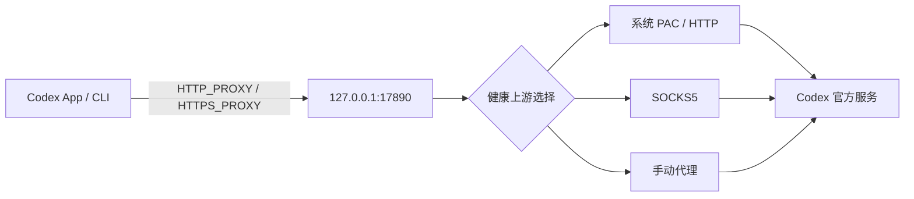

# Codex Network Guard

> 非 OpenAI 官方项目。Codex Network Guard 与 OpenAI 无隶属或背书关系。

Codex Network Guard（`cng`）面向已经有 VPN/代理、可以使用 Codex，但 App 或 CLI 经常断流、等待多轮重试的 macOS 用户。它给 Codex 提供一个地址固定的本地代理入口，并在 VPN 重启、切换模式或改变端口时自动选择新的健康上游。

它不会承诺消灭所有 `5/5` 重试。认证失败、限流、服务端故障、Codex app-server 崩溃和工具状态异常也可能触发相似现象，`cng doctor` 会尽量把这些故障与网络问题分开。

## 安全边界

- 只监听 `127.0.0.1:17890`，仅接受本机连接。
- 不启用 TUN，不修改 macOS 全局代理，不读取或修改 VPN 配置。
- 不做 TLS 中间人，不读取 Codex 请求正文、对话或账号令牌。
- 默认禁止直连回退；VPN 不可用时快速返回诊断错误，避免流量静默绕过 VPN。
- 手动上游包含账号密码时只写入 macOS Keychain。
- RPC 使用权限为 `0600` 的 Unix Socket；日志保留 7 天且总量最多 20 MB。

## 工作方式



守护进程每 5 秒重新发现代理并进行 TCP、CONNECT、TLS、HTTPS/WebSocket Upgrade 路由检查。上游按“健康状态 → 来源优先级 → 延迟”排序。切换仅影响新连接；已经建立的健康 WebSocket 不会被强制中断。

自动发现顺序：

1. 用户手动设置（凭据进 Keychain）
2. macOS 系统代理和 PAC
3. 现有 `HTTP_PROXY` / `HTTPS_PROXY` / `ALL_PROXY`
4. Clash、Surge、V2Ray 等常见本地端口（必须通过协议实测才会采用）

## 安装

### 面向普通用户

GitHub Releases 中的通用 `.dmg` 会同时支持 Apple Silicon 和 Intel。打开菜单栏应用后点击“一键检测并启用”，完成检测 Codex、检测 VPN、连接测试和登录自启。首次只需重新打开一次 Codex。

当前仓库版本是开发构建；没有 Developer ID 签名和公证的产物会明确标记为 `development`。正式面向新手发布前应配置签名、公证和更新签名。

### 从源码运行

要求 macOS 13+ 和 Rust stable：

```bash
brew install rust
cargo build --workspace
cargo test --workspace
./target/debug/cng service install
```

安装成功后关闭并重新打开一次 Codex。菜单栏界面可用以下命令启动：

```bash
cargo run -p cng-desktop
```

安装只复制 `cng`、`cngd` 和 `cng-codex` 到用户的 Application Support 目录，并创建自己的 LaunchAgent。不会修改 `~/.codex/config.toml`。卸载：

```bash
cng service uninstall
```

如果你希望终端里直接输入 `codex` 也自动经过保护，可选执行：

```bash
cng service terminal-enable
# 恢复：
cng service terminal-disable
```

这只在 `~/.zprofile` 中添加带明确边界的 PATH 管理块，卸载时也会移除。

## CLI

```text
cng status [--json]
cng refresh [--json]
cng doctor [--json] [--export PATH]
cng upstream list [--json]
cng upstream set auto
cng upstream set URL
cng codex -- <ARGS>
cng remote start|stop|pair
cng service status|install|restart|uninstall
cng service migrate-legacy
cng service terminal-enable|terminal-disable
```

示例：

```bash
cng status
cng upstream set socks5h://127.0.0.1:7891
cng doctor --export ~/Desktop/cng-diagnostic.json
cng codex -- --version
```

`doctor` 的导出内容会脱敏代理凭据和用户主目录。分享前仍建议人工浏览一次。

## 旧版原型迁移

检测到 `com.openai.codex-proxy-guard` 时，`cng` 只提示，不会自动修改。先安装并确认新守护进程正常，再明确执行：

```bash
cng service migrate-legacy
```

该命令先备份旧 LaunchAgent 和已知脚本，再停用旧服务；不会删除旧文件，也不会触碰不属于本项目的代理配置。

## 支持范围与限制

- v1：macOS 13+，Codex App 和 CLI，HTTP/HTTPS CONNECT/SOCKS5 上游。
- “兼容各类 VPN”指兼容 VPN 暴露的系统 PAC、HTTP 或 SOCKS5 本地入口；不控制 VPN 节点。
- 如果 VPN 只有一个入口且节点本身质量差，工具只能诊断并建议在 VPN 内换节点。
- 手机远程保活只保证电脑端 Codex 远程进程通过固定代理运行；手机仍需能访问官方服务。
- PAC v1 从脚本中提取明确的 `PROXY`/`HTTPS`/`SOCKS` 路由，不执行任意 PAC JavaScript。复杂的按域名动态 PAC 应手动指定其本地代理入口。
- Windows 核心适配在后续版本；当前服务管理和 Keychain 实现仅支持 macOS。

## 开发

详细架构和测试矩阵见 [docs/architecture.md](docs/architecture.md) 与 [docs/testing.md](docs/testing.md)。贡献前运行：

```bash
cargo fmt --all -- --check
cargo clippy --workspace --all-targets -- -D warnings
cargo test --workspace
```

构建通用架构 DMG 需要 `rustup`、两个 macOS target 和 Tauri CLI：

```bash
cargo install tauri-cli --version '^2' --locked
./scripts/build-macos-universal.sh
```

许可证：[Apache-2.0](LICENSE)。安全问题请按 [SECURITY.md](SECURITY.md) 私下报告。
