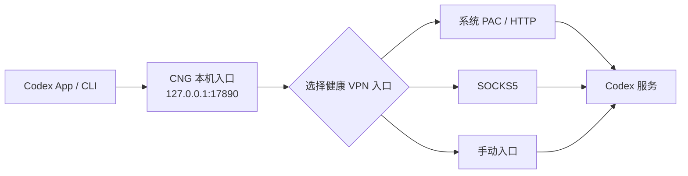

<p align="center">
  
</p>

<h1 align="center">Codex Network Guard</h1>

<p align="center"><strong>让 Codex 稳定走你的 VPN，不再靠反复重试碰运气。</strong></p>

<p align="center">
  <a href="README.en.md">English</a> ·
  <a href="https://github.com/bei666qi-pan/codex_no5-5/releases">下载 Releases</a> ·
  <a href="#快速开始">快速开始</a> ·
  <a href="#常见问题">常见问题</a>
</p>

> 非 OpenAI 官方项目。Codex Network Guard（简称 `CNG`）与 OpenAI 无隶属或背书关系。

Codex 能打开但经常卡在 `5/5`、VPN 重启后要等很久才恢复、App 和 CLI 的代理行为不一致？CNG 为 **Codex App 和 CLI** 提供一个固定的本机入口：它会发现你的 VPN 已经暴露的 PAC、HTTP、HTTPS CONNECT 或 SOCKS5 入口，并把新的 Codex 连接交给当前健康的路径。

## 目录

- [快速开始](#快速开始)
- [它能解决什么](#它能解决什么)
- [支持范围](#支持范围)
- [安全与隐私](#安全与隐私)
- [常见问题](#常见问题)
- [CLI 与高级使用](#cli-与高级使用)
- [开发、测试与发布](#开发测试与发布)

## 快速开始

### 面向零基础用户

1. 从 [GitHub Releases](https://github.com/bei666qi-pan/codex_no5-5/releases) 下载：macOS 使用 `.dmg`，Windows 使用 x64 便携 ZIP。
2. 打开 **Codex Network Guard**，点击 **「一键检测并启用」**。
3. 关闭并重新打开一次 Codex。

就这么多。以后 VPN 切换节点、重启或本地端口变化时，不需要重启 CNG。界面右上角可在中文和 English 之间即时切换，并会记住选择。

### 看到状态后怎么做

| 状态 | 代表什么 | 下一步 |
| --- | --- | --- |
| **连接受保护** | Codex 正通过健康 VPN 路径连接 | 正常使用 |
| **需要 VPN** | 没有发现可用的本地代理入口 | 启动 VPN，点击「刷新检测」 |
| **连接需要关注** | 路径可用但近期不稳定 | 在 VPN 内换节点或协议，再刷新 |
| **Codex 需要处理** | 登录、限流、服务端或 Codex 自身问题 | 按界面建议处理，不必盲目切 VPN |

## 它能解决什么

| 常见问题 | CNG 的处理 |
| --- | --- |
| Codex 没有稳定继承代理 | 对 Codex 注入固定本机代理入口，不修改系统全局代理 |
| VPN 重启、切换节点后端口变化 | 每 5 秒重新发现并选择健康上游；切换只作用于新连接 |
| HTTP 与 SOCKS5 模式不同 | 统一转为标准 HTTP/HTTPS CONNECT 本地入口 |
| VPN 不可用时担心直连 | 默认阻止直连回退，并返回可诊断错误 |
| 不知道 `5/5` 是网络、登录还是限流 | `cng doctor` 分类代理、DNS、TLS、WebSocket、401/403、429、5xx 与 Codex 故障 |



## 支持范围

“兼容各类 VPN”指兼容 VPN 在**本机**暴露的标准代理入口，而不是读取、修改或控制 VPN 的节点、订阅和规则。

| 暴露方式 | 支持情况 | 自动化验证 |
| --- | --- | --- |
| macOS 系统代理与 PAC | 支持 | `scutil` 字段、PAC 路由解析 |
| Windows 系统代理与 PAC | 支持 | 注册表字段、协议映射 |
| HTTP 本地端口 | 支持 | CONNECT 隧道、407、端口恢复 |
| HTTPS CONNECT 本地端口 | 支持 | 候选发现与连接路径 |
| SOCKS5 / mixed port | 支持 | SOCKS5 握手与远端 DNS |
| Clash Verge Rev、ClashX、Surge、V2RayU 等 | 兼容上述入口 | 以客户端实际暴露方式为准 |

自动化测试还会断言：VPN 停止时目标地址不会收到任何直连流量；VPN 端口变化后，已建立的健康隧道不被强制中断，下一条连接会走新路径。完整矩阵见 [docs/testing.md](docs/testing.md)。复杂的按域名动态 PAC 不执行任意 PAC JavaScript；遇到这种情况，请在应用的「手动设置本地代理」中填写该 VPN 的本机 HTTP 或 SOCKS5 地址。

## 安全与隐私

- 仅监听 `127.0.0.1:17890`，只接受本机连接。
- 不启用 TUN，不修改系统全局代理，不读取或修改 VPN 配置。
- 不做 TLS 中间人，不读取 Codex 对话、代码、账号令牌或请求正文。
- 默认禁止直连回退；VPN 不可用时快速报错。
- macOS 手动上游包含凭据时存入 Keychain；诊断日志会脱敏，保留最多 7 天和 20 MB。

## 常见问题

### 自动检测不到 VPN，怎么办？

展开应用中的「手动设置本地代理」，填写 VPN 软件显示的本机地址，例如 `http://127.0.0.1:7890` 或 `socks5h://127.0.0.1:7891`。不要填写机场订阅链接。填写后 CNG 会先测试再使用；选择「恢复自动选择」即可回到默认模式。

### CNG 能保证永远不出现 `5/5` 吗？

不能诚实地这样承诺。它会解决代理继承、端口变化、HTTP/SOCKS 不兼容和路由失败等网络问题；但登录失效、账户权限、429 限流、服务端异常或 Codex 本身故障也可能触发相似重试。请使用「查看诊断详情」或 `cng doctor` 确认类别。

### 支持手机远程吗？

支持电脑端的远程控制保活。它只保证电脑上的 Codex 进程通过固定代理运行；手机自身仍需能够访问官方服务。

## CLI 与高级使用

```text
cng status [--json]
cng refresh [--json]
cng doctor [--json] [--export PATH]
cng upstream list [--json]
cng upstream set auto
cng upstream set URL
cng codex -- <ARGS>
cng remote start|stop|pair
cng service status|install|restart|uninstall
cng service migrate-legacy
cng service terminal-enable|terminal-disable
```

```bash
cng status
cng upstream set socks5h://127.0.0.1:7891
cng doctor --export ~/Desktop/cng-diagnostic.json
cng codex -- --version
```

`doctor` 会脱敏代理凭据和用户目录；在分享诊断文件前，仍建议人工浏览一次。启用 `terminal-enable` 时，CNG 只在 `~/.zprofile` 添加带明确边界的 PATH 管理块，可用 `terminal-disable` 完整移除。

## 开发、测试与发布

### 从源码运行

要求 macOS 13+ 与 Rust stable：

```bash
brew install rust
cargo build --workspace
cargo test --workspace
./target/debug/cng service install
```

启动桌面应用：

```bash
cargo run -p cng-desktop
```

### 贡献前检查

```bash
node --test apps/desktop/ui/ui.test.js
cargo fmt --all -- --check
cargo clippy --workspace --all-targets -- -D warnings
cargo test --workspace
```

架构与测试矩阵分别位于 [docs/architecture.md](docs/architecture.md) 和 [docs/testing.md](docs/testing.md)。构建 macOS 通用 DMG 使用 `./scripts/build-macos-universal.sh`；构建 Windows 便携 ZIP 使用 `./scripts/build-windows-portable.ps1`。

## 许可证与安全

本项目使用 [Apache-2.0](LICENSE)。安全问题请按 [SECURITY.md](SECURITY.md) 私下报告。
