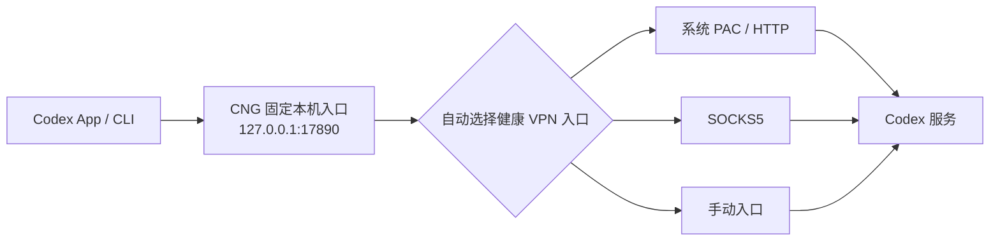

<p align="center">
  
</p>

<h1 align="center">Codex Network Guard</h1>

<p align="center"><strong>让 Codex 稳定走你的 VPN，不再靠反复重试碰运气。</strong></p>

<p align="center">
  <a href="https://github.com/bei666qi-pan/codex_no5-5/releases">下载 Releases</a> ·
  <a href="#三步开始">三步开始</a> ·
  <a href="#常见问题">常见问题</a>
</p>

> 非 OpenAI 官方项目。Codex Network Guard（简称 `CNG`）与 OpenAI 无隶属或背书关系。

你已经有 VPN、也能打开 Codex，但它常常卡在 `5/5`、重试很久才连接？CNG 就是为这个场景做的。它会为 **Codex App 和 CLI** 建立一个固定的本机入口，自动接住你的 VPN；VPN 重启、切换节点、端口变化后，下一次 Codex 连接会自动改走新的可用路径。

**你不需要懂代理、端口、TUN 或 PAC。** 正常情况下，打开应用后点一次「一键检测并启用」，重新打开一次 Codex，就可以继续使用。

## 它能替你做什么

| 你遇到的情况 | CNG 的处理 |
| --- | --- |
| Codex 明明开了 VPN，还是经常卡在重试 | 固定把 Codex 指向本地守护入口，不依赖 App 偶然继承系统代理 |
| VPN 重启或节点切换后端口变了 | 每 5 秒重新发现可用入口；新连接自动改走新端口 |
| 你的 VPN 是 Clash、Surge、V2Ray，或者别的客户端 | 识别它暴露的系统 PAC、HTTP、HTTPS CONNECT 或 SOCKS5 本地入口 |
| VPN 暂停时担心 Codex 悄悄直连 | 默认直接拦住，并告诉你该启动 VPN 还是换节点 |
| 一直 `5/5` 但不确定是不是网络问题 | `doctor` 区分代理、DNS、TLS、WebSocket、401/403、429、服务端和 Codex 自身故障 |

## 三步开始

1. 从 [Releases](https://github.com/bei666qi-pan/codex_no5-5/releases) 下载适合你的版本：macOS 下载 `.dmg`，Windows 下载 x64 便携 ZIP。
2. 打开 **Codex Network Guard**，点击 **「一键检测并启用」**。
3. 关闭并重新打开一次 Codex。以后 VPN 切换或重启，不需要重启 CNG。

完成后，你只需要看应用顶部：

- **连接受保护**：已经正常工作，放心使用。
- **需要 VPN**：先启动 VPN，再点「刷新检测」。
- **连接需要关注**：VPN 能用但不够稳定，建议在 VPN 内换节点后刷新。
- **Codex 需要处理**：不是网络问题，界面会直接告诉你下一步。

## 为什么它更稳



它只切换**新连接**，不会为了换线路强行断掉正在正常工作的 WebSocket。它也不会碰你的 VPN 节点、订阅或规则；只使用 VPN 已经在电脑本机暴露的入口。

## 支持哪些 VPN

不用在意 VPN 软件的名字，关键是它是否提供了本地代理入口。下面这些方式都在自动化测试中覆盖：

| 你的 VPN 设置 | 是否支持 | 你需要做什么 |
| --- | --- | --- |
| macOS 系统代理 / 自动配置 PAC | 支持 | 保持 VPN 正常开启即可 |
| Windows 系统代理 / 自动配置 PAC | 支持 | 保持 VPN 正常开启即可 |
| HTTP 或 HTTPS CONNECT 本地端口 | 支持 | 通常无需填写；检测不到再去「手动设置」粘贴地址 |
| SOCKS5 / mixed port | 支持 | 通常无需填写；检测不到再去「手动设置」粘贴地址 |
| Clash Verge Rev、ClashX、Surge、V2RayU 等 | 兼容其提供的以上入口 | 不读取、不修改 VPN 内部配置 |

自动化测试会验证 HTTP CONNECT、SOCKS5 远端 DNS、PAC（`PROXY` / `HTTPS` / `SOCKS`）、macOS/Windows 系统代理解析、407 验证失败、端口切换和禁止直连泄漏。不同客户端的节点质量、订阅规则和复杂动态 PAC 不属于任何工具可以保证的范围；若自动发现不到，直接填写 VPN 的本机 HTTP 或 SOCKS5 地址即可。

## 安全边界

- 只监听 `127.0.0.1:17890`，仅接受本机连接。
- 不启用 TUN，不修改 macOS 全局代理，不读取或修改 VPN 配置。
- 不做 TLS 中间人，不读取 Codex 请求正文、对话或账号令牌。
- 默认禁止直连回退；VPN 不可用时快速返回诊断错误，避免流量静默绕过 VPN。
- 手动上游包含账号密码时只写入 macOS Keychain。
- RPC 使用权限为 `0600` 的 Unix Socket；日志保留 7 天且总量最多 20 MB。

## 常见问题

### 我看到“需要 VPN”，怎么办？

先启动 VPN，再点击「刷新检测」。如果仍然没有成功，展开应用中的「手动设置本地代理」，填入 VPN 软件显示的本机地址，例如 `http://127.0.0.1:7890` 或 `socks5h://127.0.0.1:7891`。**不要**填写机场订阅链接。

### 我看到“Codex 需要处理”，是不是 VPN 坏了？

不是。它表示网络路径正常，问题可能是登录、账户权限、429 限流、服务端繁忙或 Codex 自身状态。按界面给出的操作处理即可，不需要反复切换 VPN。

### 还会不会出现 `5/5`？

CNG 会解决 Codex 没有稳定继承 VPN、端口变化、HTTP/SOCKS 不兼容和网络路由失败等问题；但 `5/5` 也可能来自登录、限流或服务端，因此它不能诚实地承诺消除所有重试。遇到问题时，点击「查看诊断详情」或运行 `cng doctor`，结果会直接标出类别。

### 我担心隐私和流量泄漏。

CNG 只监听本机 `127.0.0.1:17890`，不启用 TUN、不改系统全局代理、不解密 HTTPS，也不读取 Codex 对话、代码、账号令牌或 VPN 配置。VPN 不可用时默认阻止直连，避免流量静默绕过 VPN。导出诊断不包含代理密码、对话或令牌。

## 安装

### 面向普通用户

macOS 请从 GitHub Releases 下载通用 `.dmg`（同时支持 Apple Silicon 和 Intel）；Windows 请下载 x64 便携 ZIP 并运行 `cng-desktop.exe`。打开菜单栏应用后点击“一键检测并启用”，完成检测 Codex、检测 VPN、连接测试和登录自启。首次只需重新打开一次 Codex。

当前仓库版本是开发构建；没有 Developer ID 签名和公证的产物会明确标记为 `development`。正式面向新手发布前应配置签名、公证和更新签名。

### 从源码运行

要求 macOS 13+ 和 Rust stable：

```bash
brew install rust
cargo build --workspace
cargo test --workspace
./target/debug/cng service install
```

安装成功后关闭并重新打开一次 Codex。菜单栏界面可用以下命令启动：

```bash
cargo run -p cng-desktop
```

安装只复制 `cng`、`cngd` 和 `cng-codex` 到用户的 Application Support 目录，并创建自己的 LaunchAgent。不会修改 `~/.codex/config.toml`。卸载：

```bash
cng service uninstall
```

如果你希望终端里直接输入 `codex` 也自动经过保护，可选执行：

```bash
cng service terminal-enable
# 恢复：
cng service terminal-disable
```

这只在 `~/.zprofile` 中添加带明确边界的 PATH 管理块，卸载时也会移除。

## CLI

```text
cng status [--json]
cng refresh [--json]
cng doctor [--json] [--export PATH]
cng upstream list [--json]
cng upstream set auto
cng upstream set URL
cng codex -- <ARGS>
cng remote start|stop|pair
cng service status|install|restart|uninstall
cng service migrate-legacy
cng service terminal-enable|terminal-disable
```

示例：

```bash
cng status
cng upstream set socks5h://127.0.0.1:7891
cng doctor --export ~/Desktop/cng-diagnostic.json
cng codex -- --version
```

`doctor` 的导出内容会脱敏代理凭据和用户主目录。分享前仍建议人工浏览一次。

非 JSON 的 `cng status` 还会显示守护进程判断出的“下一步”；脚本和其他客户端可继续使用稳定的 `--json` 输出，新增字段不会破坏既有消费者。

## 旧版原型迁移

检测到 `com.openai.codex-proxy-guard` 时，`cng` 只提示，不会自动修改。先安装并确认新守护进程正常，再明确执行：

```bash
cng service migrate-legacy
```

该命令先备份旧 LaunchAgent 和已知脚本，再停用旧服务；不会删除旧文件，也不会触碰不属于本项目的代理配置。

## 支持范围与限制

- macOS 13+：完整桌面端、LaunchAgent、Keychain 手动凭据和通用架构 DMG。
- Windows 10/11 x64：完整桌面端、命名管道控制接口、任务计划程序登录自启、系统显式代理/PAC 发现，以及便携 ZIP。首次启用后需重新打开一次 Codex。
- Windows 手动上游暂只支持无凭据的 HTTP/HTTPS/SOCKS5 URL；带凭据上游请由 VPN 客户端提供本地无凭据入口。
- “兼容各类 VPN”指兼容 VPN 暴露的系统 PAC、HTTP 或 SOCKS5 本地入口；不控制 VPN 节点。
- 如果 VPN 只有一个入口且节点本身质量差，工具只能诊断并建议在 VPN 内换节点。
- 手机远程保活只保证电脑端 Codex 远程进程通过固定代理运行；手机仍需能访问官方服务。
- PAC v1 从脚本中提取明确的 `PROXY`/`HTTPS`/`SOCKS` 路由，不执行任意 PAC JavaScript。复杂的按域名动态 PAC 应手动指定其本地代理入口。
- Windows 发布物是 x64 便携 ZIP，需 Windows WebView2 Runtime（Windows 10/11 通常已自带）。正式 NSIS/MSI 安装器和代码签名将在后续发布中提供。

## 开发

详细架构和测试矩阵见 [docs/architecture.md](docs/architecture.md) 与 [docs/testing.md](docs/testing.md)。贡献前运行：

```bash
cargo fmt --all -- --check
cargo clippy --workspace --all-targets -- -D warnings
cargo test --workspace
```

构建通用架构 DMG 需要 `rustup`、两个 macOS target 和 Tauri CLI：

```bash
cargo install tauri-cli --version '^2' --locked
./scripts/build-macos-universal.sh
```

构建 Windows 便携 ZIP：

```powershell
./scripts/build-windows-portable.ps1
```

许可证：[Apache-2.0](LICENSE)。安全问题请按 [SECURITY.md](SECURITY.md) 私下报告。
