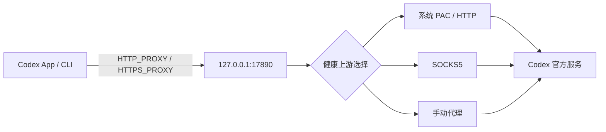

# Codex Network Guard

> 非 OpenAI 官方项目。Codex Network Guard 与 OpenAI 无隶属或背书关系。

Codex Network Guard（`cng`）面向已经有 VPN/代理、可以使用 Codex，但 App 或 CLI 经常断流、等待多轮重试的 macOS 用户。它给 Codex 提供一个地址固定的本地代理入口，并在 VPN 重启、切换模式或改变端口时自动选择新的健康上游。

它不会承诺消灭所有 `5/5` 重试。认证失败、限流、服务端故障、Codex app-server 崩溃和工具状态异常也可能触发相似现象，`cng doctor` 会尽量把这些故障与网络问题分开。

## 安全边界

- 只监听 `127.0.0.1:17890`，仅接受本机连接。
- 不启用 TUN，不修改 macOS 全局代理，不读取或修改 VPN 配置。
- 不做 TLS 中间人，不读取 Codex 请求正文、对话或账号令牌。
- 默认禁止直连回退；VPN 不可用时快速返回诊断错误，避免流量静默绕过 VPN。
- 手动上游包含账号密码时只写入 macOS Keychain。
- RPC 使用权限为 `0600` 的 Unix Socket；日志保留 7 天且总量最多 20 MB。

## 工作方式



守护进程每 5 秒重新发现代理并进行 TCP、CONNECT、TLS、HTTPS/WebSocket Upgrade 路由检查。上游按“健康状态 → 来源优先级 → 延迟”排序。切换仅影响新连接；已经建立的健康 WebSocket 不会被强制中断。

自动发现顺序：

1. 用户手动设置（凭据进 Keychain）
2. macOS 系统代理和 PAC
3. 现有 `HTTP_PROXY` / `HTTPS_PROXY` / `ALL_PROXY`
4. Clash、Surge、V2Ray 等常见本地端口（必须通过协议实测才会采用）

## 新手使用闭环

首次打开菜单栏应用，只需要完成“一键检测并启用”：它会检查 Codex、检查 VPN 的本地代理入口、验证 HTTPS/WebSocket 路径并安装登录自启。成功后只需重新打开一次 Codex。

日常使用时先看顶部结论，而不是猜测 `5/5` 的含义：

- **已保护**：Codex 正通过 CNG 的固定本地入口使用健康代理。
- **连接降级**：代理还可用；如果持续重试，请在 VPN 内换节点或协议，然后点“重新检测”。
- **VPN 未启动**：CNG 已阻止静默直连；先启动 VPN，再点“重新检测”。
- **非网络故障**：会明确显示是登录/账户、429 限流、服务端异常还是 Codex 自身问题，并给出下一步。

若自动发现失败，展开桌面端的“高级”区域，填入 VPN 在本机暴露的 HTTP 或 SOCKS5 地址。填写后会先验证再使用；“恢复自动选择”会回到无配置模式。

“导出脱敏诊断”会将 JSON 报告写到桌面（桌面目录不可用时写到 CNG 数据目录）。其中不包含 Codex 对话、账号令牌或代理密码。

## 安装

### 面向普通用户

macOS 请从 GitHub Releases 下载通用 `.dmg`（同时支持 Apple Silicon 和 Intel）；Windows 请下载 x64 便携 ZIP 并运行 `cng-desktop.exe`。打开菜单栏应用后点击“一键检测并启用”，完成检测 Codex、检测 VPN、连接测试和登录自启。首次只需重新打开一次 Codex。

当前仓库版本是开发构建；没有 Developer ID 签名和公证的产物会明确标记为 `development`。正式面向新手发布前应配置签名、公证和更新签名。

### 从源码运行

要求 macOS 13+ 和 Rust stable：

```bash
brew install rust
cargo build --workspace
cargo test --workspace
./target/debug/cng service install
```

安装成功后关闭并重新打开一次 Codex。菜单栏界面可用以下命令启动：

```bash
cargo run -p cng-desktop
```

安装只复制 `cng`、`cngd` 和 `cng-codex` 到用户的 Application Support 目录，并创建自己的 LaunchAgent。不会修改 `~/.codex/config.toml`。卸载：

```bash
cng service uninstall
```

如果你希望终端里直接输入 `codex` 也自动经过保护，可选执行：

```bash
cng service terminal-enable
# 恢复：
cng service terminal-disable
```

这只在 `~/.zprofile` 中添加带明确边界的 PATH 管理块，卸载时也会移除。

## CLI

```text
cng status [--json]
cng refresh [--json]
cng doctor [--json] [--export PATH]
cng upstream list [--json]
cng upstream set auto
cng upstream set URL
cng codex -- <ARGS>
cng remote start|stop|pair
cng service status|install|restart|uninstall
cng service migrate-legacy
cng service terminal-enable|terminal-disable
```

示例：

```bash
cng status
cng upstream set socks5h://127.0.0.1:7891
cng doctor --export ~/Desktop/cng-diagnostic.json
cng codex -- --version
```

`doctor` 的导出内容会脱敏代理凭据和用户主目录。分享前仍建议人工浏览一次。

非 JSON 的 `cng status` 还会显示守护进程判断出的“下一步”；脚本和其他客户端可继续使用稳定的 `--json` 输出，新增字段不会破坏既有消费者。

## 旧版原型迁移

检测到 `com.openai.codex-proxy-guard` 时，`cng` 只提示，不会自动修改。先安装并确认新守护进程正常，再明确执行：

```bash
cng service migrate-legacy
```

该命令先备份旧 LaunchAgent 和已知脚本，再停用旧服务；不会删除旧文件，也不会触碰不属于本项目的代理配置。

## 支持范围与限制

- macOS 13+：完整桌面端、LaunchAgent、Keychain 手动凭据和通用架构 DMG。
- Windows 10/11 x64：完整桌面端、命名管道控制接口、任务计划程序登录自启、系统显式代理/PAC 发现，以及便携 ZIP。首次启用后需重新打开一次 Codex。
- Windows 手动上游暂只支持无凭据的 HTTP/HTTPS/SOCKS5 URL；带凭据上游请由 VPN 客户端提供本地无凭据入口。
- “兼容各类 VPN”指兼容 VPN 暴露的系统 PAC、HTTP 或 SOCKS5 本地入口；不控制 VPN 节点。
- 如果 VPN 只有一个入口且节点本身质量差，工具只能诊断并建议在 VPN 内换节点。
- 手机远程保活只保证电脑端 Codex 远程进程通过固定代理运行；手机仍需能访问官方服务。
- PAC v1 从脚本中提取明确的 `PROXY`/`HTTPS`/`SOCKS` 路由，不执行任意 PAC JavaScript。复杂的按域名动态 PAC 应手动指定其本地代理入口。
- Windows 发布物是 x64 便携 ZIP，需 Windows WebView2 Runtime（Windows 10/11 通常已自带）。正式 NSIS/MSI 安装器和代码签名将在后续发布中提供。

## 开发

详细架构和测试矩阵见 [docs/architecture.md](docs/architecture.md) 与 [docs/testing.md](docs/testing.md)。贡献前运行：

```bash
cargo fmt --all -- --check
cargo clippy --workspace --all-targets -- -D warnings
cargo test --workspace
```

构建通用架构 DMG 需要 `rustup`、两个 macOS target 和 Tauri CLI：

```bash
cargo install tauri-cli --version '^2' --locked
./scripts/build-macos-universal.sh
```

构建 Windows 便携 ZIP：

```powershell
./scripts/build-windows-portable.ps1
```

许可证：[Apache-2.0](LICENSE)。安全问题请按 [SECURITY.md](SECURITY.md) 私下报告。
